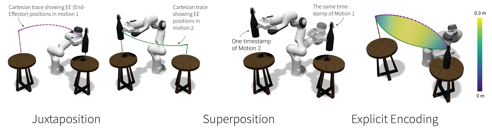

<div align="center">
    <h1>Motion Comparator</h1>
    <a href= "https://uwgraphics.github.io/MotionComparator"></a>
    <a href= "https://uwgraphics.github.io/MotionComparator"></a>
    <a href= "https://github.com/uwgraphics/MotionComparator/releases"></a>
</div>

Motion Comparator is a web-based application to visualize, compare, and share robot motions. For more details, please refer to our [RA-L paper](https://arxiv.org/pdf/2407.02746).




## Installation
We recommend using the [hosted version of Motion Comparator](https://uwgraphics.github.io/MotionComparator/). 

If you would like to play around with the code, the dependencies of Motion Comparator can be installed by:
```
cd MotionComparator
git submodule init
git submodule update
npm install
npm start
```

[MotionComparator-Examples](https://github.com/uwgraphics/MotionComparator-Examples) contains the robot URDFs and object models used in the examples.

## Contributing

Motion Comparator is written in [TypeScript](https://www.typescriptlang.org/) using [React](https://react.dev/) and [rc-dock](https://github.com/ticlo/rc-dock) – contributions are welcome!

## Credits
Motion Comparator draws a lot of design inspiration from robot visualization tools, especially [Foxglove Studio](https://github.com/foxglove/studio) and [Webviz](https://github.com/cruise-automation/webviz). The teaser image is generated by AI using NightCafe Studio.

If you find Motion Comparator useful for research, please cite our RA-L paper. 
```
@ARTICLE{wang2024motion,
  title={Motion Comparator: Visual Comparison of Robot Motions}, 
  author={Wang, Yeping and Peseckis, Alexander and Jiang, Zelong and Gleicher, Michael},
  journal={IEEE Robotics and Automation Letters}, 
  year={2024},
  volume={9},
  number={9},
  pages={7699-7706},
  doi={10.1109/LRA.2024.3430649}
}
```

## TODO
- [ ] Support ROS 2 bags
- [ ] Update to the latest version of three.js
